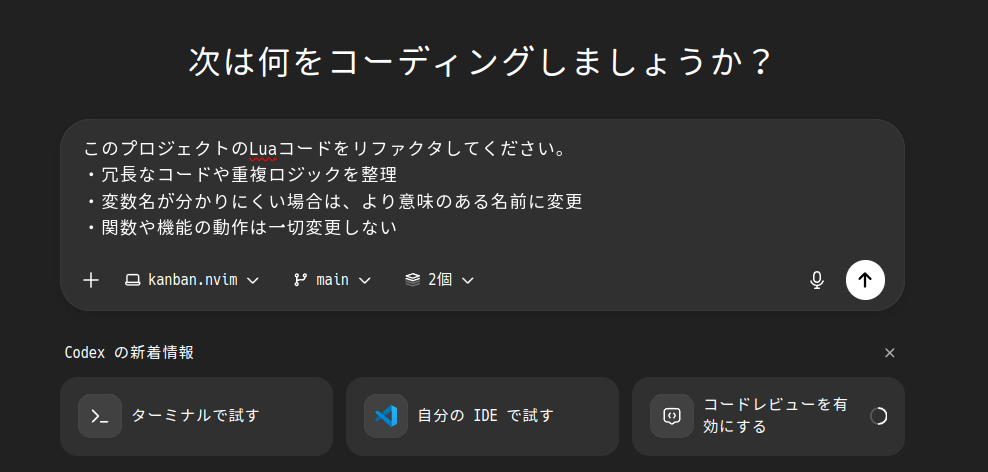
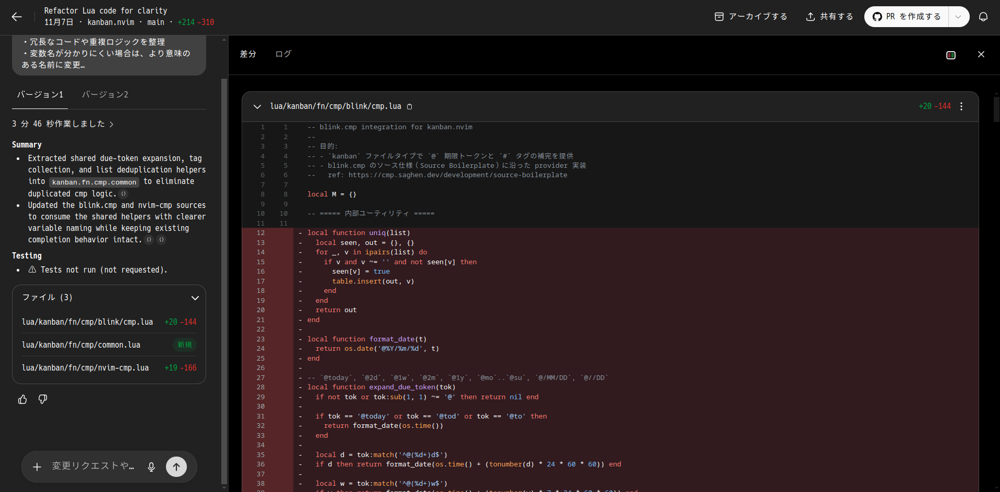

## Codexとは

OpenAI主導のオープンソース「Codex」のブラウザUIは、PCに特別なセットアップを行わずに、Webブラウザだけで「AIと一緒に開発」を実現するクラウドIDEです。ポイントは次の3つです。

- AIがコードの読み解きと変更案の提案を行い、差分パッチとして提示する
- リポジトリ（ブランチ）を指定して安全に作業し、必要に応じて複数案を比較検討できる
- 会話（プロンプト）と計画（/plan 等）を軸に、設計→実装→検証→リファクタまでを一貫支援する

このエントリでは、ブラウザ版Codexの全体像、実務での使い方、プロンプト設計の勘所、CLI版との使い分け、そして失敗しにくいワークフローをまとめます。

※CLIやIDEからも使えます

## ブラウザ版Codexでできること

**日々の開発作業を“会話で駆動”する**のが特徴です。代表的な機能と具体的な活用イメージを挙げます。

- 設計レビューと要件すり合わせ
  - 既存コードやREADMEを読み取り、ゴール・制約・テスト観点を要約。
- コード生成と安全な編集
- 計画駆動の実装（/plan）
  - 作業を小さなステップに分解し、進捗に応じて更新。途中での方針転換も明瞭です（後述）。
- リファクタ提案とドキュメント更新
  - 命名、分割、責務の明確化を提案。変更に伴うREADMEやコメントの追随も依頼可能。
- トラブルシューティング支援
  - エラーログを貼ると原因仮説→切り分け手順→修正案までを段階的に提示。

ブラウザで利用できるのでスマホでも手軽に利用できる。電車やお風呂でも開発ができます。

## まずは触ってみる

1. Codexへアクセスし、対象の `repository` と作業する `branch` を選択。
2. 必要に応じて「バージョン（複数案）」を有効化。比較レビューがしやすくなります。
3. 最初のプロンプトでゴールと制約を明確化（例は後述）。
4. 変更提案は必ず差分を確認してから反映。大きい差分は/planで段階化。
5. 反映後はテスト・ビルド・静的解析など、既存の検証手段で確認します。

補助コマンドの例：

- `/plan` 作業計画の作成・更新。ステップを短く保つと失敗に強い。
- （運用ルール）「1トピック＝1PR」を徹底。大規模変更はサブタスクに分割。

## 実践ミニチュートリアル：安全な小さな変更を積む

ここでは、例として私が開発しているNeovimプラグインをリファクタしてもらいます

1) プロンプト作成
かなり雑ではありますが、お試しということで以下で試行してみます
* プロンプト
```
このプロジェクトのLuaコードをリファクタしてください。
・冗長なコードや重複ロジックを整理
・変数名が分かりにくい場合は、より意味のある名前に変更
・関数や機能の動作は一切変更しない
```
* repository: arakkkkk/kanban.nvim
* branch: main
* version: 2つ（2パターンの提案を出してくれます）



2) 実行
プロンプトの入力が完了したら、実行ボタンから実行します

3) 結果表示

プロンプト下のタスクタブに結果が一覧されるので、そこから結果を表示します。


4) 差分をレビューして反映

結果は以下のように表示されます。
さらに、左サイドバーのチャット欄から追加で指示をすることも可能です。
- 差分の粒度が大きい場合は「ステップ2と3を分けて提案して」とリクエスト。
- 命名やエラーメッセージは「既存に合わせる/揃えて」と再指示。

UIの表記は環境により異なる場合があります。



5) PRを作成

画面左上の「PRを作成する」ボタンからGitHubのPull Requestを作成できます。
エディター/CLIを使わない開発は少し寂しいですが...開発はだいぶ楽になりそうです。


## /plan機能

Codexでは、プロンプトで`/plan`というコマンドが利用可能です。
これは**コード変更の計画（PLAN）を生成するための専用モード／コマンド**です。
と言ってもよくわからないので例を紹介します。

例えば、以下プロンプトで修正提案をしてみます。

```text
/plan
冗長なコードをリファクタし、変数名を分かりやすく改善したい。
動作は変えずにコードの可読性を向上させる。
```

しかし、このような指示の方法だと複数の関数をまとめて修正されてレビューが大変になります。(AIコーディングあるあるだと思います)
`/plan`コマンドでは、これを解決できます！

実際に実行した結果は以下のようになります。
このように、`/plan`を使うことで修正を分割してタスクとして表示してくれます。あとは対象のタスクを選んで「タスクを開始」をクリックすることで個々の変更を適用できます。


少々時間がかかりますが、完了するとボタンが「タスクを表示する」に変わるので、クリックして変更内容を確認します。
以降のPR作成までの手順は通常と同じです。`/plan`で提示された変更ごとにPRを作成することができます。


## 成果が変わるプロンプト設計

短い指示ほど強いですが、前提は十分に与えます。私がよく使う型を紹介します。

- ゴール宣言型
  - 「目的」「制約」「評価基準」「出力形式」を1ブロックで明示。
- 境界指定型
  - 触ってよいファイル範囲、禁止事項（公開API変更・破壊的変更・不要リネーム等）。
- 比較検討型
  - 2〜3案を出させ、採用理由・トレードオフを簡潔に。差分は最小の案を優先。
- 漸進型
  - 大改修は“段取り”に分ける。「まず型だけ」「次に実装」「最後に最適化」。

## 品質と安全性を高めるワークフロー

- 小さく始めて小さくマージ
  - 1PRの変更を「1目的」に限定。ロールバック容易性を常に意識。
- 既存の検証手段を尊重
  - Linter/Formatter/Tests/Build を会話の外で必ず実行して裏取り。
- 差分は“理由”付き
  - 変更には必ず動機を書く。将来の自分と同僚へのドキュメント。
- 計画の継続更新
  - /plan を最新に保ち、途中の軌道修正を見える化。

## よくあるつまずきと対処

- 出力が過剰・空回りする
  - 「差分は最小」「既存スタイルを踏襲」「不要なリネーム禁止」を明言。
- 複数ファイルに跨る影響が読めない
  - まず影響調査だけを依頼→次に小さな変更1つ、の順で段階化。
- 大規模リファクタが一気に来る
  - “段取り化”を要求し、各段の終了基準（テスト・ビルド）を明示。
- 曖昧な要求で期待外れ
  - 目的・制約・評価基準・出力形式の4点セットに立ち返る。

## CLI版との使い分け

- ブラウザ版
  - 手早い設計議論、差分レビュー、複数案の比較に最適。
  - スマホでも手軽に利用できる。移動中など短時間でもレビューや指示が可能（音声入力も可能）。
- CLI版
  - ローカルのテスト実行や既存ツール連携をフル活用。自動化パイプラインにも載せやすい。
