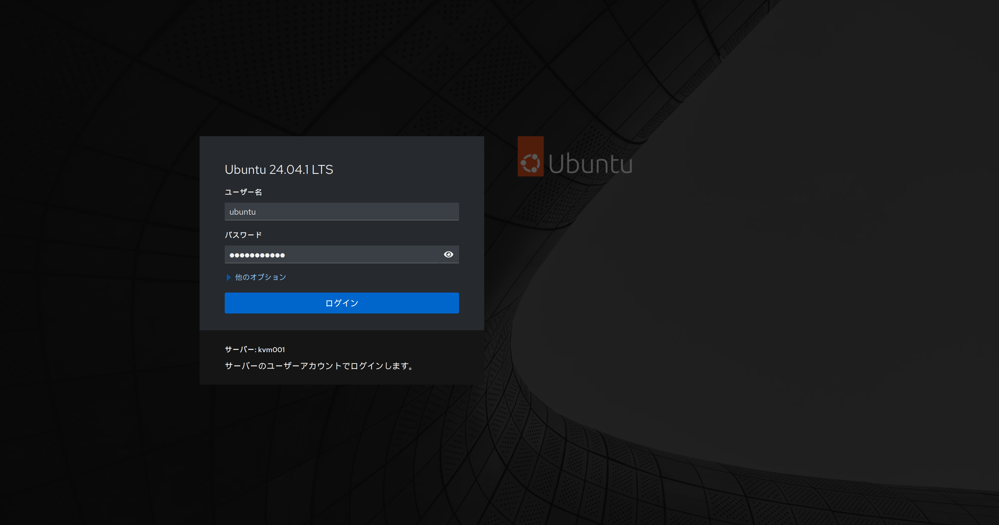
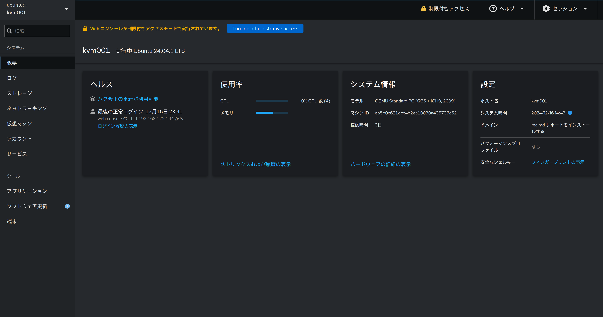
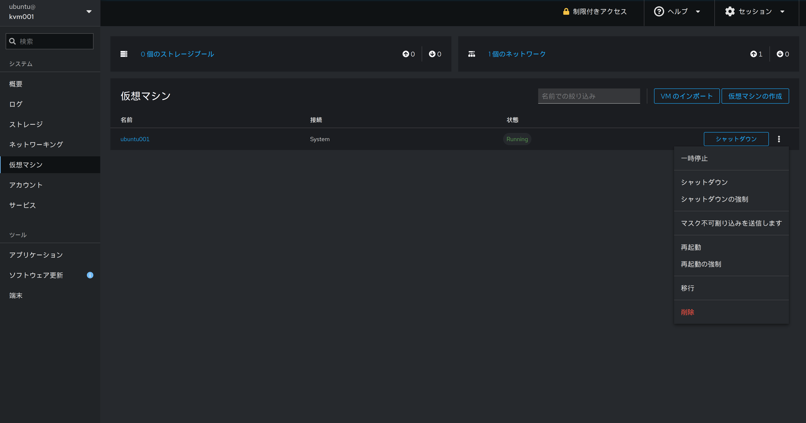
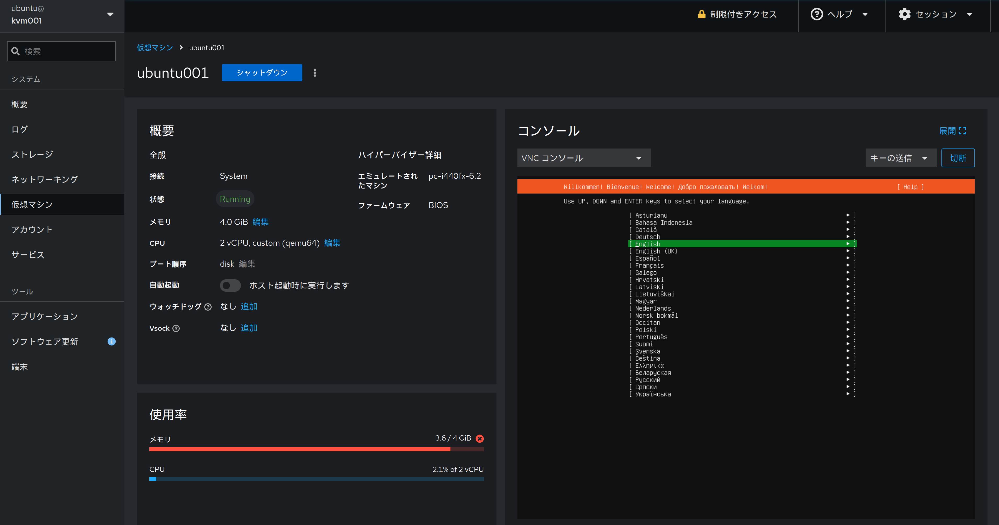
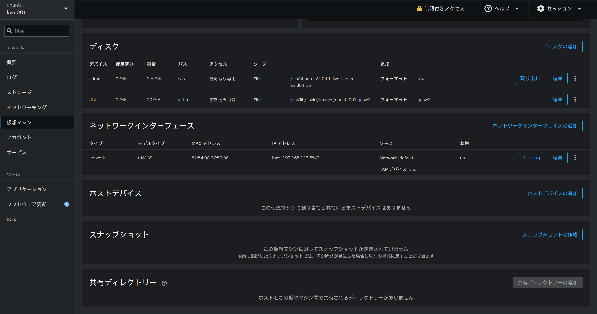
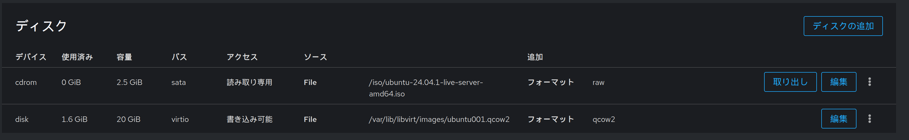
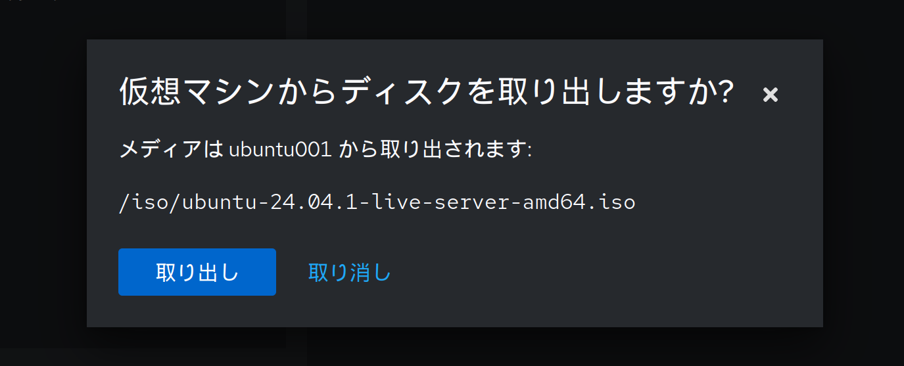

前回はvirshを使って、CLIからVMを構築しました。今回はVMをブラウザから操作するためのcockpitをインストールして動かして見ようと思います

## cockpitとは:
cockpitとは、下記特徴を持つソフトウェアです。今回は仮想化のために使用しますが、それはあくまでcockpitの機能の一部を利用する形となります
* Linuxシステムのサーバ管理用webサーバー
* LinuxシステムのCPU、メモリ、ネットワーク、ストレージなどのシステムリソースの使用状況をリアルタイムで監視できる
* 仮想マシンの作成、起動、停止、スナップショットの作成等簡単な操作をGUIで行うことができる
* 小規模な環境やシンプルな仮想化運用に適している

その他のソフトウェアも気になっているので、後々記事にしていければと思っています

以下は、LinuxにCockpitをインストールして仮想マシンを確認する手順を紹介するブログのMarkdown形式のサンプルです。

## cockpitのインストールと起動

以下のコマンドを実行して、cockpitと仮想マシンの管理に必要なパッケージをインストールします。

```bash
sudo apt install cockpit cockpit-machines
```

インストールが完了したら、Cockpitサービスを開始します。

```bash
sudo systemctl start cockpit
```

## cockpit Webインターフェースにアクセス

cockpitの起動が完了したため、Webブラウザから9090ポートで管理画面にアクセスできます。  

```
https://<サーバーのIPアドレス>:9090
```

以下のようなログインページが表示されるため、ubuntuのログインユーザーでログインします



ログインすると以下のような画面になります



そして、仮想マシンのタブを開くと既に作成しているubuntu001が確認でき、  
このページからは仮想マシンに対して以下の操作が可能となっています
* VMのインポート/新規作成
* VMの電源操作(起動、停止、再起動)
* VMの移行
* VMの削除



また、VM名をクリックすることでその仮想マシンの詳細を確認することができます





ここからVMのコンソールを操作することができるため、ここで作成したubuntu001のセットアップを行ないます  
(この記事では本手順は省略します。わからない方は[こちら](https://gihyo.jp/admin/serial/01/ubuntu-recipe/0820)を参考にしていただけると良いかもしれません。)

<!--  -->
<!--  -->
