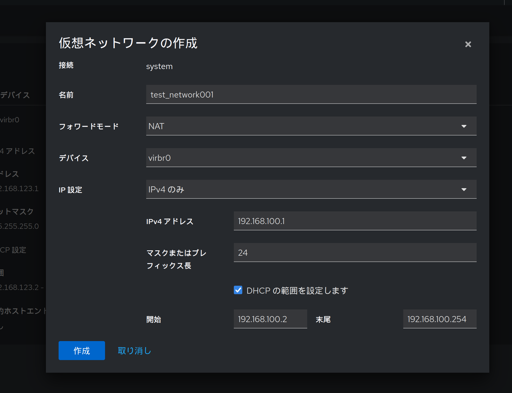

前回はcockpitでWebブラウザからVMを確認するところまでを実施しました。今回はcockpitからVMを構築してみようと思います。

## ネットワークの作成

前回作成したubuntu001は、デフォルトで作成されていたネットワーク(`default`)にアタッチしました。  
今回は新しくネットワークを作成し、そこにアタッチする形にしようと思います

cockpitの仮想マシンタブから`1個のネットワーク`をクリックします

上の画像のようにdefaultネットワークの情報が確認できました  
`仮想ネットワークの作成`よりネットワークを作成します

設定は以下を入力し、作成ボタンをクリックします
* 名前: test_network001
* フォワードモード: NAT (NATを使用してグローバルに出ることができる設定)
* デバイス: virbr0 (virbr0を設定しておくと新規でブリッジ`virbr1`が作成され、利用されます)
* IP設定: IPv4のみ
  * IPv4 アドレス: 192.168.100.1
  * マスクまたはプレフィックス長: 24
  * DHCPの範囲を設定します: ☑
  * 開始: 192.168.100.2 / 末尾: 192.168.100.254

新しく`test_network001`のネットワークが作成されたことが確認できます  
また、デバイスに`virbr0`を指定して作成しましたが、自動的に新しいブリッジ`virbt1`が作成され、デバイスに指定されていることが確認できます  
`有効化`をクリックすることで、このネットワークが利用可能になります。ホスト起動時に自動的に起動されるよう`自動起動`を有効にしておきましょう

## VMの構築

それではいよいよ仮想マシンの作成をしてみようと思います

cockpitの仮想マシンから、仮想マシンの作成をクリックします

表示される作成画面に、以下情報を入力し、`作成して実行する`をクリックしましょう
* 接続: System
* インストールタイプ: ローカルインストールメディア
* インストールソース: /iso/ubuntu-24.04.1-live-server-amd64.iso
* オペレーティングシステム: Ubuntu 24.04 LTS (Noble Numbat)
* ストレージ: qcow2ボリュームの新規作成
* ストレージの制限: 20GB
* メモリ: 4GB

作成してまもなく仮想マシンの一覧に追加され、状態が `Runnningになっていることが確認できます`

作成したubuntu002を開いてみると、VMの情報と共に画面右側のコンソールではUbuntuのインストールが始まっていることが確認できます  

ディスクとネットワークの設定は以下図のようになっています。  
ディスクはメインで使用するdiskと、OSをインストールするためのcdromがアタッチされています  
ネットワークをみると`default`のネットワークがアタッチされていることがわかります。新しく作成したネットワークにしたいので、変更をしてみましょう

ネットワークの編集ボタンをクリックし、開かれる画面から`ソース`を`test_network001`に変更します

これにより、インターフェースのソースとIPが変更されていることが確認できます  

以上がcockpitからのVM作成の手順になります。virshを用いた方法と比較してかなり簡単に作成できることがわかります

## VMの構築②(番外編)

前の章では、cockpitで一から仮想マシンを作成しましたが、既存のVMをコピーすることで更に簡単にVMを作成することができます

以下手順でVMのコピーを実施します
* コピー元の仮想マシンをシャットダウンする
* コピー元仮想マシンの右側三点リーダーからクローンを選択
* 名前を入力してクローンをクリック

終わりです。コピー元VMからコピーして新しいVMが作成されました

以上、cockpitを使って仮想マシンを作成する方法を紹介しました。  
次回は仮想マシンがアタッチされる、仮想ネットワークについて書いていこうと思います
