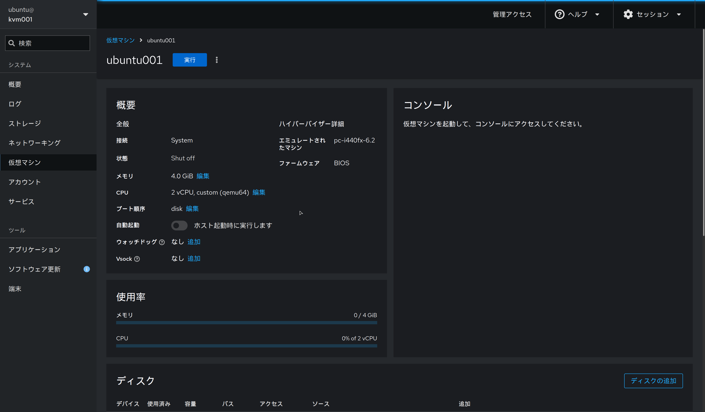
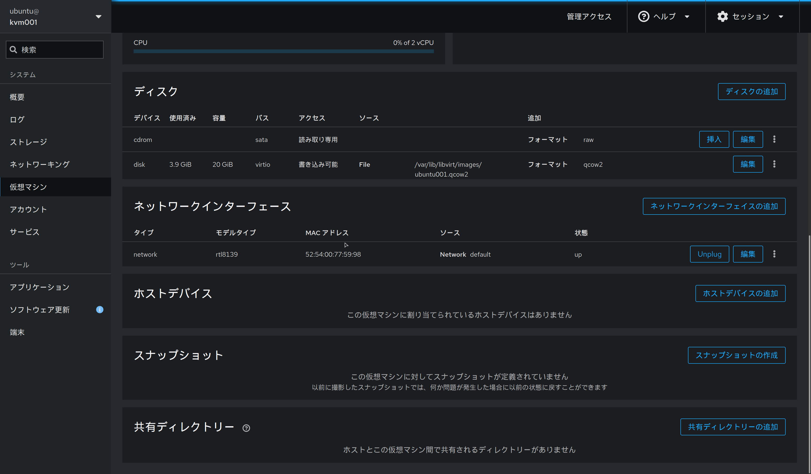

自宅でKVMを使ったシンプルなインフラ環境を構築します
Proxyサーバーを介してWebサーバーへ接続し、さらにDNSで名前解決をできるようにします
最終的にgrafanaで各サーバーの監視設定を行うところまでをやろうと思います

## 構築の流れ

* 1.構成と準備  <-ここ
* 2.Webサーバーの構築
* 3.Proxyサーバーの構築
* 4.DNSサーバーの構築
* 5.Grafanaで監視基盤の構築

## ネットワーク構成のイメージ図

扱うネットワークは以下の２つです
* 管理用ネットワーク: 192.168.122.0/24
    * Webサーバーを利用するクライアントが接続されているネットワーク
    * このネットワークからProxyを介してWebサーバーにアクセスします
* KVMの仮想ネットワーク: 192.168.123.0/24
    * Webサーバーが接続されるローカルネットワーク


## 利用するソフトウェア

仮想マシンの作成やネットワークの設定には[Cockpit](https://www.redhat.com/en/blog/manage-virtual-machines-cockpit)を使用します

## KVMホストの構成

本シリーズ用に物理のホストを用意できなかったため、Nested KVM構成で行います

* CPU: 4vCPU
* メモリ: 16GB
* ストレージ: 100GB
* OS: Ubuntu 24.04

## ネットワーク構成

仮想ネットワークには、デフォルトで作成される`default`を使用します
```
$ virsh net-list
 Name      State    Autostart   Persistent
--------------------------------------------
 default   active   yes         yes
```

この仮想ネットワークの詳細は`net-dumpxml`で確認することができ、以下の通りです
* NATモード で動作し、仮想マシンが外部ネットワークへアクセス可能
* 仮想ブリッジvirbr0を使用して通信を管理
* ホストのIP (192.168.123.1) がゲートウェイとして機能
* DHCP により、 192.168.123.2 〜 192.168.123.254 の範囲でIPアドレスを自動割り当て
```
$ virsh net-dumpxml default
<network>
  <name>default</name>
  <uuid>61c20183-757b-402f-a92e-677072b910d0</uuid>
  <forward mode='nat'>
    <nat>
      <port start='1024' end='65535'/>
    </nat>
  </forward>
  <bridge name='virbr0' stp='on' delay='0'/>
  <mac address='52:54:00:a3:31:ff'/>
  <ip address='192.168.123.1' netmask='255.255.255.0'>
    <dhcp>
      <range start='192.168.123.2' end='192.168.123.254'/>
    </dhcp>
  </ip>
</network>
```

## 仮想マシンの準備

今回は合計で4つの仮想マシンを構築します。
都度一から作成するのは面倒なのでテンプレートを作成し、それをクローンする形で使用します
スペックは以下の通りです。

* CPU: 2vCPU
* メモリ: 4GB
* ストレージ: 20GB
* OS: Ubuntu 24.04




また、クローンした仮想マシンにDHCPから異なるIPが割り当てるよう、以下設定を追記しておきます ([参考](https://qiita.com/sandopan65/items/75ca7e6563e86a7dfd8c))
```
network:
    ethernets:
        enp1s0:
            dhcp4: true
            dhcp-identifier: mac  # この行を追記
    version: 2
```

これで準備が整いました。次回は[2.Webサーバーの構築]()を進めていきます
