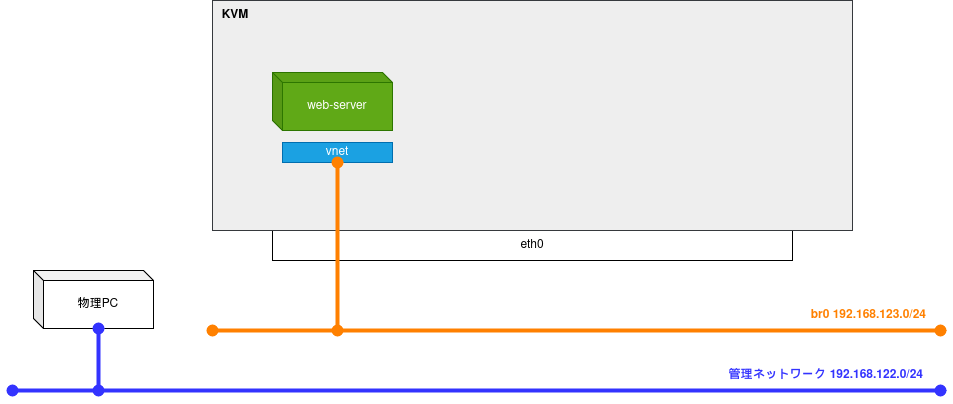
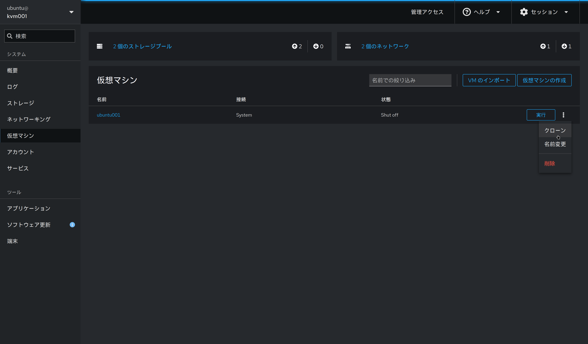
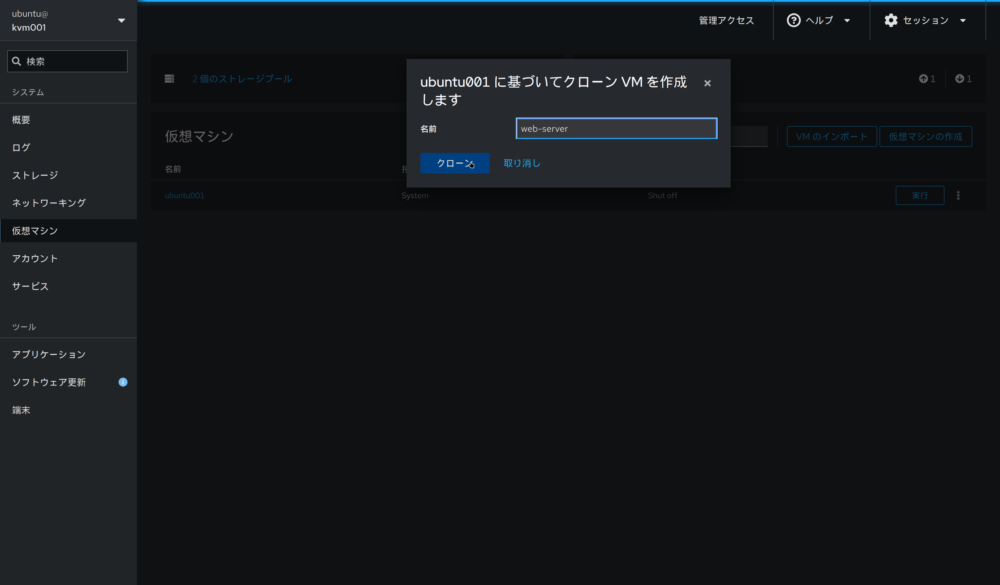
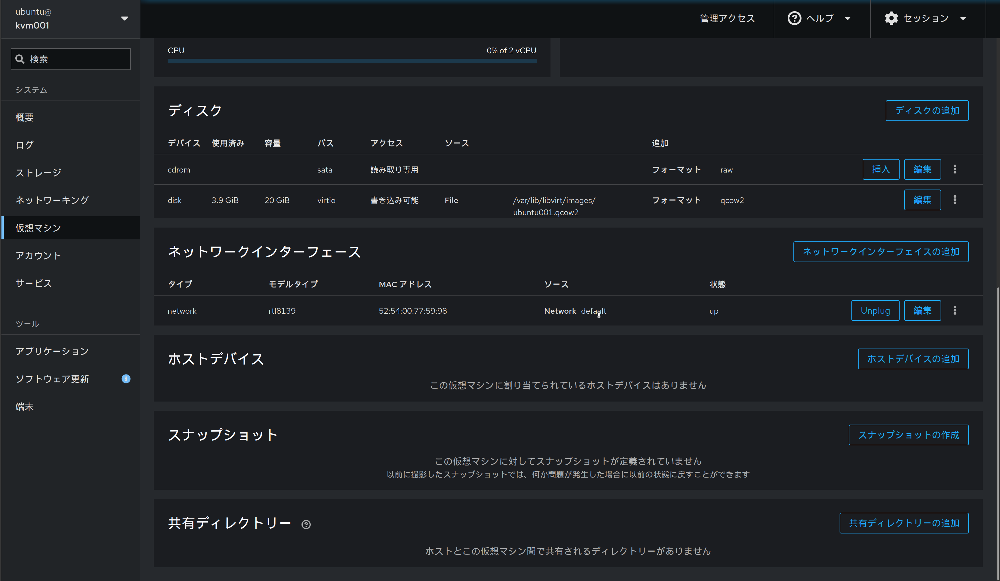
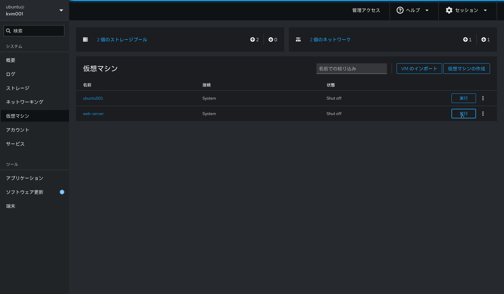
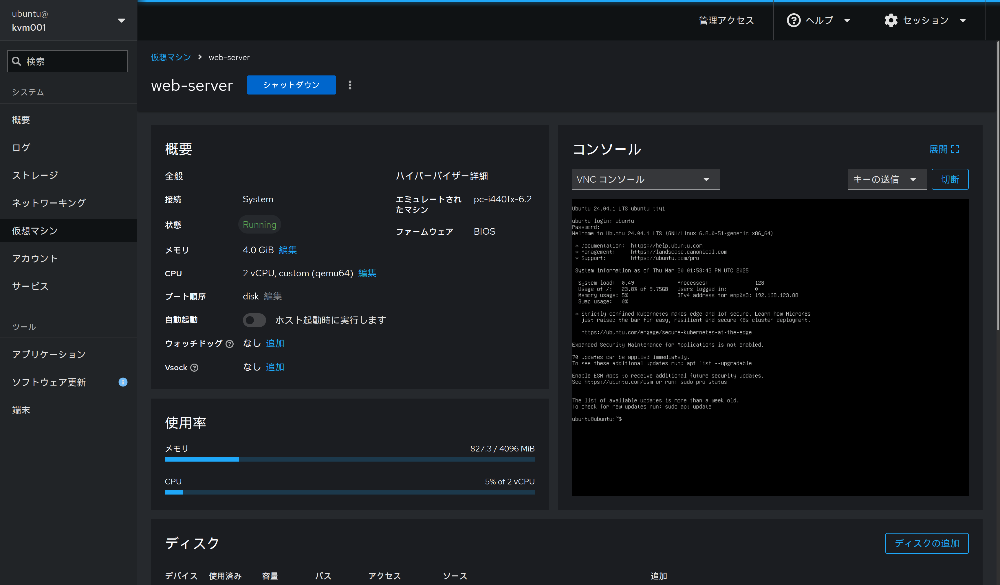

前回はこれから作成する環境の構築の紹介とその準備を行いました。
今回はOSSを用いて簡単なWebサーバーを構築します

* 1.構成と準備  
* 2.Webサーバーの構築 <-ここ
* 3.Proxyサーバーの構築
* 4.DNSサーバーの構築
* 5.Grafanaで監視基盤の構築

## ネットワーク構成のイメージ図

* 完成形
    * 

* 今回の内容
    * 


## Webサーバーに利用するOSS選び

このシリーズの目的としてはWebサーバーにこだわる必要はないのですが。。
せっかくなのでおすすめのOSSをいくつか紹介します

* [memos](https://usememos.com/)
    * シンプルで軽量な自己ホスト型のメモ管理アプリ
    * マークダウンをサポート
    * Slackのような使い心地のメモ帳
* [gitea](https://gitea.io/)
    * 軽量な自己ホスト型Gitサービス
    * GitHubのようなリポジトリ管理をローカル環境で実現できる
    * 低リソースで動作するのが特徴
* [Mattermost](https://mattermost.com/)
    * オープンソースのチーム向けチャットプラットフォーム
    * Slackの代替として利用でき、高いカスタマイズ性を持つ
* [Nextcloud](https://nextcloud.com/)
    * 自己ホスト型のクラウドストレージサービス
    * DropboxやGoogle Driveの代替として利用できる
    * ファイル共有やコラボレーション機能が充実
* [Immich](https://immich.app/)
    * オープンソースの自己ホスト型写真・動画管理システム
    * Google Photosの代替として利用できる
    * AIによる画像認識や自動バックアップ機能をもつ

今回は`memos`を使ってWebサーバーを構築します

## 仮想マシンのデプロイ

それではWebサーバー用の仮想マシンを作成していきます。
まずは`仮想マシンの準備`で作成した仮想マシンをクローンして新しい仮想マシンを作成します





作成が完了したら、仮想マシンが仮想ネットワーク`default`に接続されていることを確認します



ネットワークの確認ができたら`実行`をクリックして仮想マシンを起動します



起動が完了したら仮想マシンの画面からコンソールに入ることができます
(SSHでログインしたい場合は `KVMホスト -> 作成した仮想マシン`で接続してください)



## Webサーバーの起動

デプロイは[公式ドキュメント](https://www.usememos.com/docs/install/container-install)に沿ってDockerを使って行います。
下記dockerコマンドを実行するだけで完了です

```
sudo docker run -d \
  --init \
  --name memos \
  --publish 5230:5230 \
  --volume ~/.memos/:/var/opt/memos \
  neosmemo/memos:stable
```

まだブラウザから確認ができないため、curlコマンドでWebサーバーが動作しているか確認します

```
$ curl -I 0.0.0.0:5230
HTTP/1.1 200 OK
Accept-Ranges: bytes
Content-Length: 2784
Content-Type: text/html; charset=utf-8
Date: Thu, 20 Mar 2025 14:20:13 GMT~$ curl -I 0.0.0.0:5230
```

確認できました。これでWebサーバーの準備は完了です！
次は[3.Proxyサーバーの構築]()でProxy経由でWebサーバーにアクセスできるようにします
