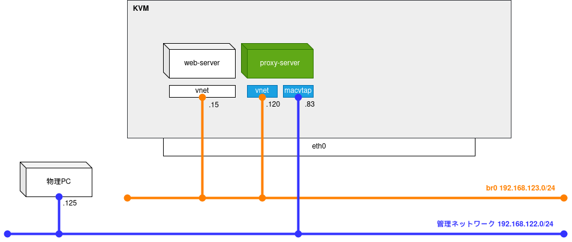
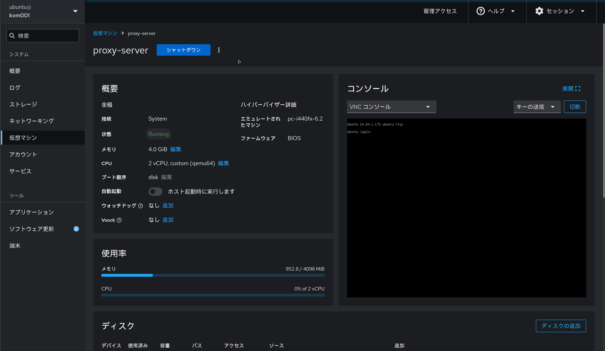
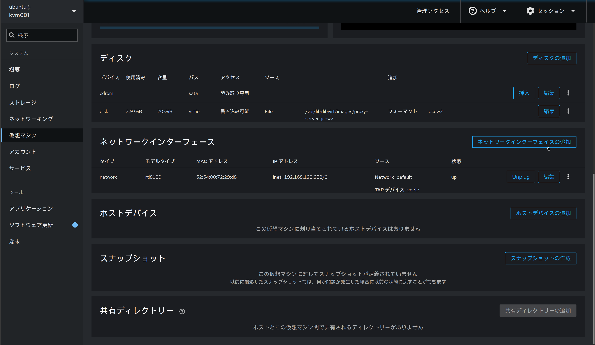
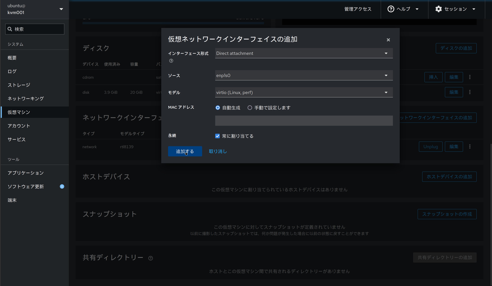
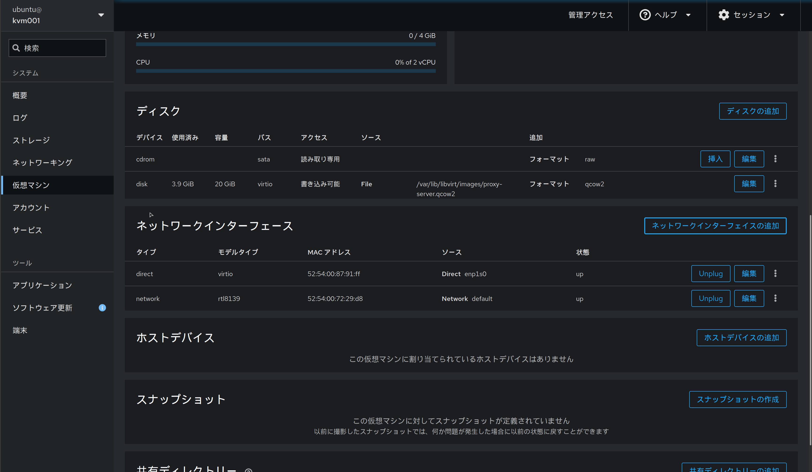
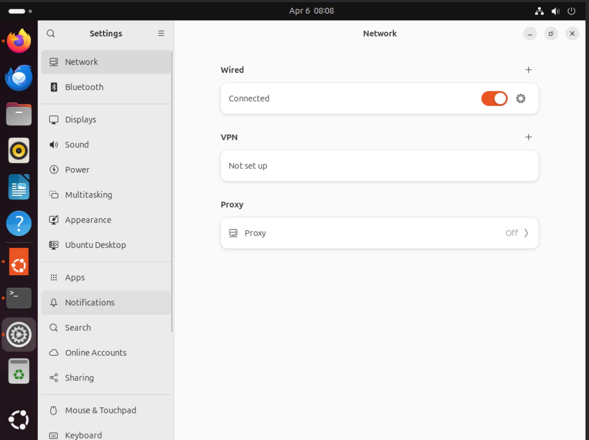
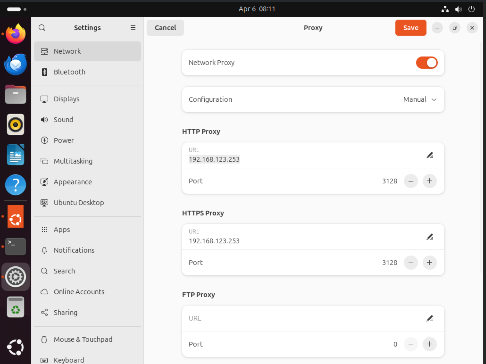
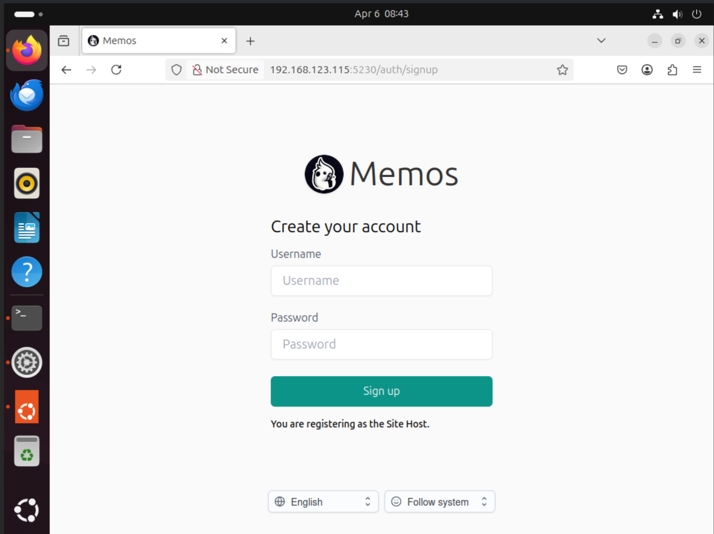
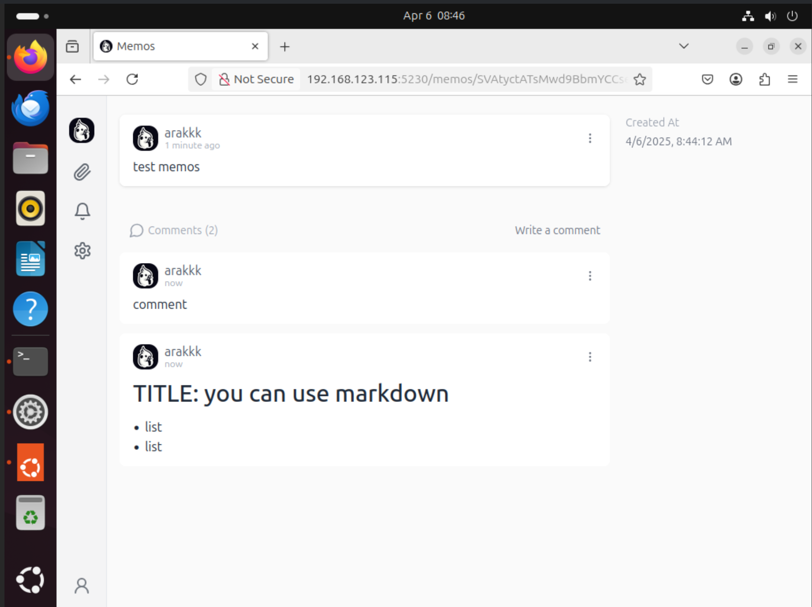

前回は仮想ネットワーク上にWebサーバーを構築しました
今回はProxyサーバーを構築し、管理ネットワークからWebサーバーを閲覧できるようにします

* 1.構成と準備  
* 2.Webサーバーの構築
* 3.Proxyサーバーの構築 <- ここ
* 4.DNSサーバーの構築
* 5.Grafanaで監視基盤の構築

## ネットワーク構成のイメージ図

* 完成形
    * 

* 今回の内容
    * 

## 仮想マシンのデプロイ

まずはProxyサーバー用の仮想マシンを作成していきます。
前回と同じ手順になるので作成や起動の手順は割愛します。(proxy-serverの名前で仮想マシンを作成しました)


つづいて、仮想マシンの仮想ネットワーク設定を行っていきます。
ProxyサーバーはWebサーバーを閲覧するPCが利用する`管理ネットワーク`と、Webサーバーが接続される`仮想ネットワーク`の両方に足を出している必要があります。
`仮想ネットワーク`にはクローン時点で既に接続されているため、新しくネットワークインターフェースを作成し、`管理ネットワーク`に接続します。
まずは仮想マシンの`ネットワークインターフェース`から`ネットワークインターフェースの追加`をクリックします


下記設定で追加します (仮想マシンがパワーオフの状態で実施する)
* インターフェース形式: Direct attachment
* ソース: enp1s0 (KVMホストの物理NICを指定します)
* モデル: virtio
* MACアドレス: 自動生成
* 永続: ☑常に割り当てる


追加が完了すると、Cockpitの画面で追加されていることが確認できます



インターフェースが追加できたので、仮想マシンの方でもネットワークの設定をしてあげます
```
$ sudo cat /etc/netplan/50-cloud-init.yaml
# This file is generated from information provided by the datasource.  Changes
# to it will not persist across an instance reboot.  To disable cloud-init's
# network configuration capabilities, write a file
# /etc/cloud/cloud.cfg.d/99-disable-network-config.cfg with the following:
# network: {config: disabled}
network:
    ethernets:
        enp0s3:
            dhcp4: true
            dhcp-identifier: mac
        enp0s7:
            dhcp4: true
    version: 2
$ sudo netplan apply
```

これで`管理ネットワーク`と`仮想ネットワーク`の両方に接続された仮想マシンが作成できました
* 管理ネットワーク側IP: 192.168.122.83
* 仮想ネットワーク側IP: 192.168.123.120

```
$ ip a show enp0s7
3: enp0s7: <BROADCAST,MULTICAST,UP,LOWER_UP> mtu 1500 qdisc pfifo_fast state UP group default qlen 1000
    link/ether 52:54:00:87:91:ff brd ff:ff:ff:ff:ff:ff
    inet 192.168.122.83/24 metric 100 brd 192.168.122.255 scope global dynamic enp0s7
       valid_lft 3465sec preferred_lft 3465sec
    inet6 fe80::5054:ff:fe87:91ff/64 scope link
       valid_lft forever preferred_lft forever
$ ip a show enp0s3
2: enp0s3: <BROADCAST,MULTICAST,UP,LOWER_UP> mtu 1500 qdisc pfifo_fast state UP group default qlen 1000
    link/ether 52:54:00:54:18:43 brd ff:ff:ff:ff:ff:ff
    inet 192.168.123.120/24 metric 100 brd 192.168.123.255 scope global dynamic enp0s3
       valid_lft 3468sec preferred_lft 3468sec
    inet6 fe80::5054:ff:fe54:1843/64 scope link
       valid_lft forever preferred_lft forever
```

## Proxyサーバの構築

squidを用いてProxyサーバーを構築します。
まずは、デプロイした仮想マシン上で`squid`をインストールします
```
$ sudo apt install squid
```

インストールが完了したら、設定を行っていきます。
設定ファイルは`/etc/squid/squid.conf`にあります。

```
$ sudo vi /etc/squid/squid.conf
```

ファイルの`1400行目`あたりに下記のような記載があるので、`Allow_Local_Network`の設定を追記します
```
# Example rule allowing access from your local networks.
# Adapt to list your (internal) IP networks from where browsing
# should be allowed
acl localnet src 0.0.0.1-0.255.255.255  # RFC 1122 "this" network (LAN)
acl localnet src 10.0.0.0/8             # RFC 1918 local private network (LAN)
acl localnet src 100.64.0.0/10          # RFC 6598 shared address space (CGN)
acl localnet src 169.254.0.0/16         # RFC 3927 link-local (directly plugged) machines
acl localnet src 172.16.0.0/12          # RFC 1918 local private network (LAN)
acl localnet src 192.168.0.0/16         # RFC 1918 local private network (LAN)
acl localnet src fc00::/7               # RFC 4193 local private network range
acl localnet src fe80::/10              # RFC 4291 link-local (directly plugged) machines
acl Allow_Local_Network src 192.168.123.0/24  # <- ★ この行を追記
```

さらに、`1601行目`あたりの下記コメントがある行に二行追記します
```
# For example, to allow access from your local networks, you may uncomment the
# following rule (and/or add rules that match your definition of "local"):
# http_access allow localnet
http_access allow localnet
http_access allow Allow_Local_Network
```

上記設定が完了したら、下記コマンドでsquidを再起動します。

```
$ sudo systemctl restart squid
```

## Proxyサーバーを経由したWebサーバーへのアクセス

Proxyサーバーの構築が完了したので、これを利用してWebサーバーへのアクセスを行います。
そのためには、WebサーバーへアクセスするクライアントにてProxyサーバーを利用する設定を行う必要があります。
今回はUbuntuサーバーを用いるため、以下の手順でProxyサーバーの設定を行います
* 「Settings」→「Network」→「Proxy」
    * 
* 「Network Proxy」を有効にし、以下設定を入力する
    * Configuration: `Manual`
    * HTTP Proxy:
        * URL: Proxyサーバーの管理用ネットワーク側のIP (`192.168.122.83`)
        * Port: ProxyサーバーのPort (`3128`)
    * HTTPS Proxy:
        * URL: Proxyサーバーの管理用ネットワーク側のIP (`192.168.122.83`)
        * Port: ProxyサーバーのPort (`3128`)
    * 

上記設定が完了したら、ブラウザでWebサーバーにアクセスができるようになります！(`http://192.168.123.15:5230`)





以上でsquidを用いたProxyサーバーの構築ができました。
次は[4.DNSサーバーの構築]()でLAでN名前解決ができるようにします

