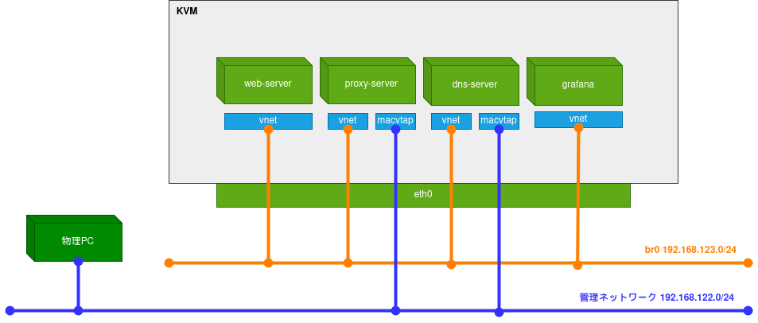
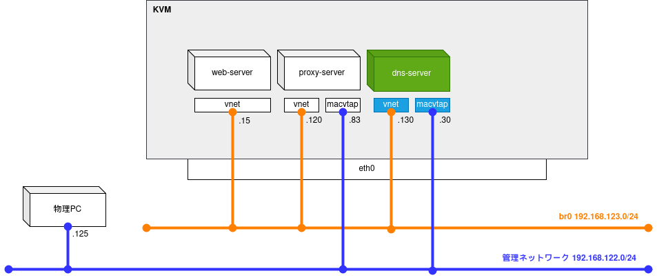
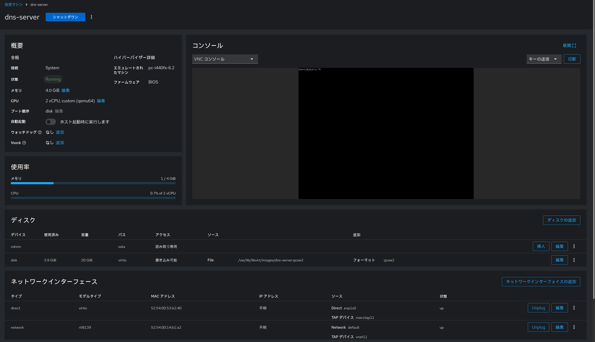
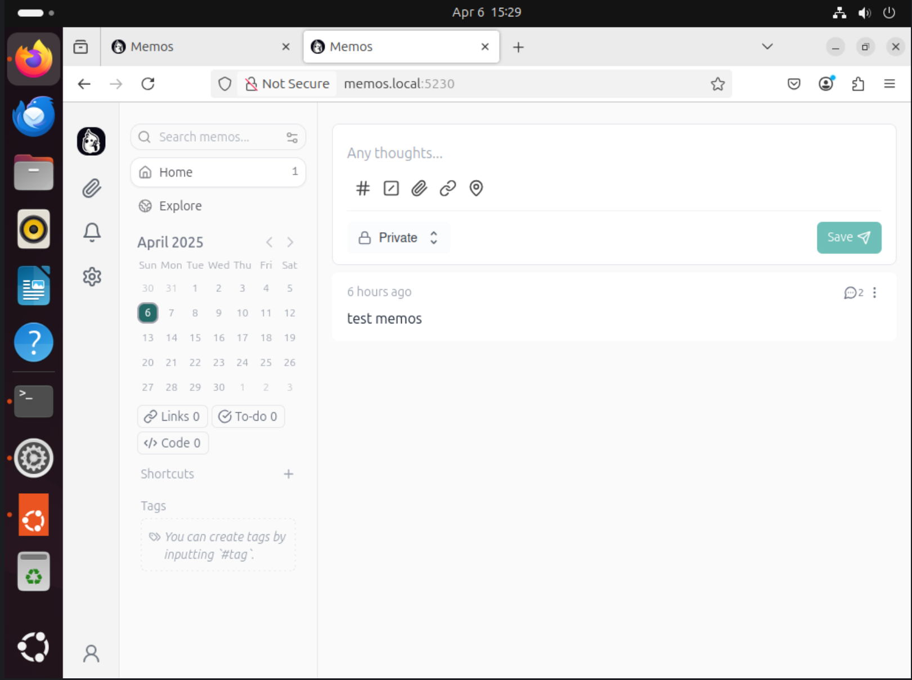
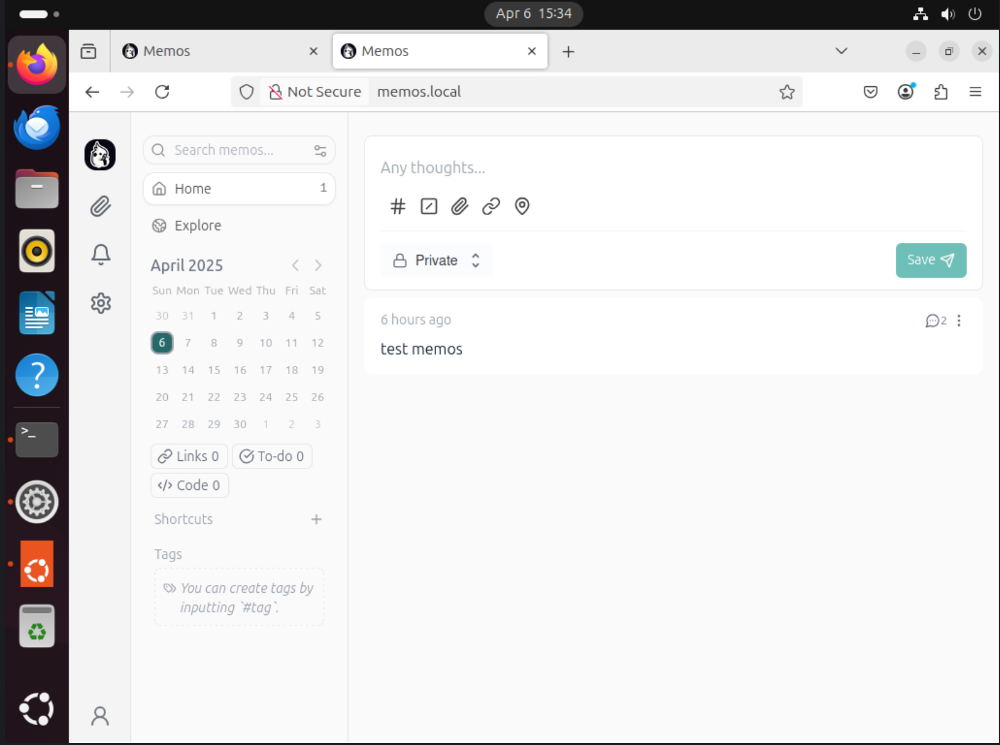

前回は仮想ネットワーク上にProxyサーバーを構築しました
今回はDNSサーバーを構築し、LANで名前解決ができるようにします

* 1.構成と準備  
* 2.Webサーバーの構築
* 3.Proxyサーバーの構築
* 4.DNSサーバーの構築 <- ここ
* 5.Grafanaで監視基盤の構築

## ネットワーク構成のイメージ図

* 完成形
    * 

* 今回の内容
    * 

## 仮想マシンのデプロイ

まずはDNSサーバー用の仮想マシンを作成していきます。
前回と同じ手順になるので作成や起動の手順は割愛します。
作成した仮想マシンの詳細は以下です
* 名前: dns-server
* 管理ネットワーク側IP: 192.168.122.30
* 仮想ネットワーク側IP: 192.168.123.130



## DNSサーバの構築

[unbound](https://unbound.docs.nlnetlabs.nl/en/latest/)を用いてDNSサーバーを構築します。
まずは、デプロイした仮想マシン上で`unbound`をインストールします
```
$ sudo apt install unbound
```

インストールが完了したら、設定を行っていきます。
設定ファイルは`/etc/unbound/unbound.conf`にあり、以下のように記載されています。

```
$ cat /etc/unbound/unbound.conf
# Unbound configuration file for Debian.
#
# See the unbound.conf(5) man page.
#
# See /usr/share/doc/unbound/examples/unbound.conf for a commented
# reference config file.
#
# The following line includes additional configuration files from the
# /etc/unbound/unbound.conf.d directory.
include-toplevel: "/etc/unbound/unbound.conf.d/*.conf"
```

`/etc/unbound/unbound.conf.d/*.conf`のファイルを読み込むように設定されているため、今回は`/etc/unbound/unbound.conf.d/unbound.conf`として設定ファイルを作成します

設定ファイルには、`server`句と`forward-zone`句の二種類を記述し、以下のように記述することで設定が可能です。

```
server:
	interface: DNSサーバーのIP
	port: 53
	access-control: 127.0.0.0/8 allow
	access-control: LANのCIDR allow
	use-syslog: yes
	log-queries: yes
    local-data: "ドメイン.    IN A 転送先のIP"

forward-zone:
	name: "."
 	forward-addr: フォワード先のプライマリDNS
 	forward-addr: フォワード先のセカンダリDNS
```

**server句**
* interface: Unboundが待ち受けるIPアドレスを指定
* port: 使用するポート番号を指定 (DNSの標準ポートは53)
* access-control: DNSリクエストを許可するクライアントのIP範囲をCIDR形式で指定
* use-syslog: ログ出力先をsyslogにするかどうかを指定。yes にすると /var/log/syslog に出力されます。
* log-queries: DNSクエリをログに記録するかどうかの設定。設定しておくとトラブルシュートや監視に便利です。
* local-data: 特定のホスト名とIPアドレスの対応を定義。("myhost.local. IN A 192.168.1.10" とすると、`myhost.local`への問い合わせには`192.168.1.10`を返します。)
**forward-zone句**
* name: `.` は「すべてのドメイン」を意味し、全てのDNSクエリをこのゾーンの設定に従って処理します。
* forward-addr: クエリを転送する先のDNSサーバーを指定。複数指定可能で、上から順に試行されます。

その他の設定は以下期に記載されているので参考にしてください
* [unbound.conf(5) | 日本Unboundユーザー会](https://unbound.jp/unbound/unbound-conf/)

今回の構成では、以下のように設定します。

```
server:
	interface: 192.168.122.30
	port: 53
	access-control: 127.0.0.0/8 allow
	access-control: 192.168.122.0/24 allow
	use-syslog: yes
	log-queries: yes
    local-data: "memos.local.    IN A 192.168.123.115"

forward-zone:
	name: "."
 	forward-addr: 8.8.8.8
```

設定が完了したらunboundを再起動します
```
$ sudo systemctl restart unbound.service
```

以上でDNSサーバー側の設定は完了です。
ここからは、構築したDNSサーバーを用いて名前解決ができるようにProxyサーバーへ設定を追加します

## Proxyサーバーで使用するDNSサーバーの指定

Proxyサーバーにて、squidで使用するDNSサーバーの設定を行います
設定はすごく簡単で、`/etc/squid/squid.conf`に以下のように設定を追加するだけです

```
dns_nameservers DNSサーバーのIP
```

`dns_nameservers`の設定について記載されている行があるので、こちらに追記します
```
#  TAG: dns_nameservers
#       Use this if you want to specify a list of DNS name servers
#       (IP addresses) to use instead of those given in your
#       /etc/resolv.conf file.
#
#       On Windows platforms, if no value is specified here or in
#       the /etc/resolv.conf file, the list of DNS name servers are
#       taken from the Windows registry, both static and dynamic DHCP
#       configurations are supported.
#
#       Example: dns_nameservers 10.0.0.1 192.172.0.4
#Default:
# Use operating system definitions
dns_nameservers 192.168.122.30                # ★追記
```

設定が完了したら、下記コマンドでsquidを再起動します。

```
$ sudo systemctl restart squid
```

それでは、構築したDNSサーバーで名前解決ができるか確認していきましょう
設定がうまく通っていれば、無事`http://memos.local:5230`でWebサーバーにアクセスできるようになっていると思います



ポート指定が不格好なので、Webサーバーのポートフォワードを変更します
```
$ sudo docker stop memos
memos
$ sudo docker rm memos
memos
$ sudo docker run -d   --init   --name memos   --publish 80:5230   --volume ~/.memos/:/var/opt/memos   neosmemo/memos:stable
bba4c0f06042e102eb7ffa0cd620f8425d4deb26d0162f32b68cb33e4c7c0461
```

これで`http://memos.local`だけでアクセスができるようになりました



## 補足:ログの確認方法

### Proxyサーバー (squid)

squidのログは`access.log`から確認ができます

```
ubuntu@ubuntu:~$ sudo tail /var/log/squid/access.log
1743953619.583      3 192.168.122.125 TCP_MISS/200 531 POST http://memos.local/memos.api.v1.WorkspaceSettingService/GetWorkspaceSetting - HIER_DIRECT/192.168.123.115 application/grpc-web+proto
1743953619.609      2 192.168.122.125 TCP_MISS/200 605 POST http://memos.local/memos.api.v1.WorkspaceSettingService/GetWorkspaceSetting - HIER_DIRECT/192.168.123.115 application/grpc-web+proto
1743953619.617      3 192.168.122.125 TCP_MISS/200 550 POST http://memos.local/memos.api.v1.AuthService/GetAuthStatus - HIER_DIRECT/192.168.123.115 application/grpc-web+proto
1743953619.625      2 192.168.122.125 TCP_MISS/200 526 POST http://memos.local/memos.api.v1.UserService/GetUserSetting - HIER_DIRECT/192.168.123.115 application/grpc-web+proto
1743953619.715      3 192.168.122.125 TCP_MISS/200 510 POST http://memos.local/memos.api.v1.UserService/ListShortcuts - HIER_DIRECT/192.168.123.115 application/grpc-web+proto
1743953619.715      5 192.168.122.125 TCP_MISS/200 510 POST http://memos.local/memos.api.v1.InboxService/ListInboxes - HIER_DIRECT/192.168.123.115 application/grpc-web+proto
1743953619.718      5 192.168.122.125 TCP_MISS/200 941 POST http://memos.local/memos.api.v1.MemoService/ListMemos - HIER_DIRECT/192.168.123.115 application/grpc-web+proto
1743953619.747      2 192.168.122.125 TCP_MISS/200 25371 GET http://memos.local/full-logo.webp - HIER_DIRECT/192.168.123.115 image/webp
1743953620.078      3 192.168.122.125 TCP_MISS/200 526 POST http://memos.local/memos.api.v1.UserService/GetUserStats - HIER_DIRECT/192.168.123.115 application/grpc-web+proto
1743953690.354   5007 192.168.122.125 TCP_TUNNEL/503 0 CONNECT push.services.mozilla.com:443 - HIER_NONE/- -
```

### DNSサーバー (unbound)

unboundのログは`/var/log/syslog`に保存されます。

```
ubuntu@ubuntu:~$ sudo tail /var/log/syslog | grep unbound
2025-04-06T15:33:28.423362+00:00 ubuntu unbound: [2930:0] info: 192.168.122.83 www.google.com. AAAA IN
2025-04-06T15:34:45.402548+00:00 ubuntu unbound: [2930:0] info: 192.168.122.83 push.services.mozilla.com. A IN
2025-04-06T15:34:45.403307+00:00 ubuntu unbound: [2930:0] info: 192.168.122.83 push.services.mozilla.com. AAAA IN
2025-04-06T15:34:50.404939+00:00 ubuntu unbound: [2930:0] info: 192.168.122.83 push.services.mozilla.com. A IN
2025-04-06T15:34:50.406916+00:00 ubuntu unbound: [2930:0] info: 192.168.122.83 push.services.mozilla.com. AAAA IN
2025-04-06T15:34:50.407588+00:00 ubuntu unbound: [2930:0] info: 192.168.122.83 push.services.mozilla.com. A IN
2025-04-06T15:34:50.408005+00:00 ubuntu unbound: [2930:0] info: 192.168.122.83 push.services.mozilla.com. AAAA IN
2025-04-06T15:34:50.408470+00:00 ubuntu unbound: [2930:0] info: 192.168.122.83 push.services.mozilla.com. A IN
2025-04-06T15:34:50.408629+00:00 ubuntu unbound: [2930:0] info: 192.168.122.83 push.services.mozilla.com. AAAA IN
```
