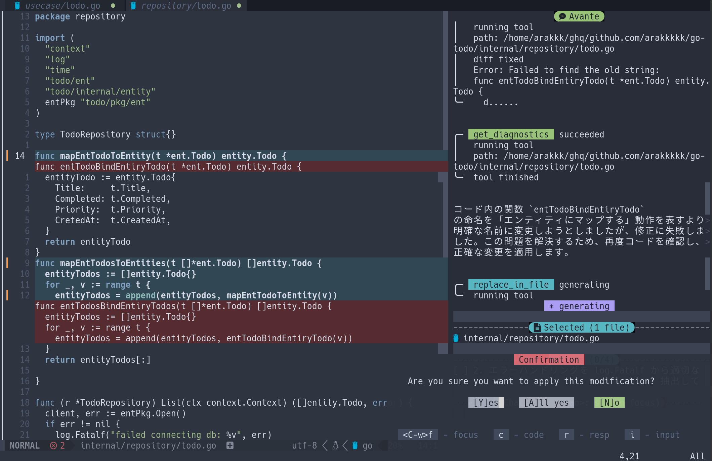
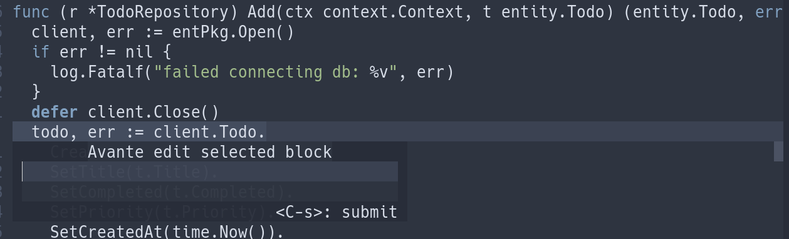
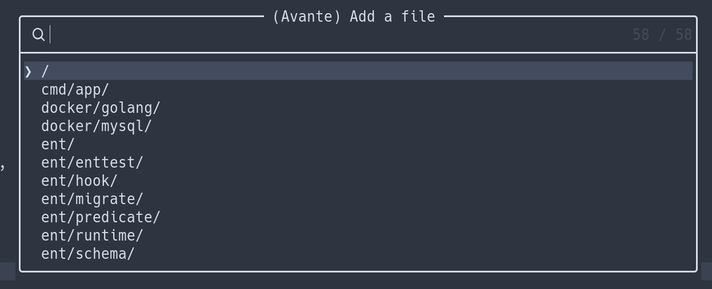

# NeovimでAvanteを使いたい人向けのガイド(2025/7/5時点)

前回はCopilot.luaについて書いたので、今回はAvanteについて紹介してみます。

## NeovimのAvanteプラグインでできること

### チャットモード

Avanteでは、コードの質問のみ行う`:AvanteAsk`と、編集を同時に行える`:AvanteChat`のコマンドが用意されています。
`:AvanteChat`では、チャットをしながらコードの変更が可能です。CopilotChatのAgentモード相当の機能を有しており、複数ファイルの編集や、ファイル作成も行ってくれます。
また、コードの差分も見やすく表示されるので使い勝手は非常に良いです。


部分的に編集したければ、`:AvanteEdit`を以下画像のように利用することも可能です。


また、mcphub.nvimを利用することでMCPも利用可能です。こちらはまだ試せていないので、別記事にて紹介しようと思います。
https://ravitemer.github.io/mcphub.nvim/extensions/avante.html

## 設定方法

ここでは `lazy.nvim` を使った設定方法を記載しています。

```lua
	{
		"yetone/avante.nvim",
		build = function()
			-- conditionally use the correct build system for the current OS
			if vim.fn.has("win32") == 1 then
				return "powershell -ExecutionPolicy Bypass -File Build.ps1 -BuildFromSource false"
			else
				return "make"
			end
		end,
		dependencies = {
			"nvim-treesitter/nvim-treesitter",
			"stevearc/dressing.nvim",
			"nvim-lua/plenary.nvim",
			"MunifTanjim/nui.nvim",
		},
		ops = {
			---@alias Provider "claude" | "openai" | "azure" | "gemini" | "cohere" | "copilot" | string
	        provider = "copilot",
		}
	},
```

## Avanteで使えるプロンプトの接頭辞

### `@mentions`
`@mentions`を使うことでプロンプトに情報を追加することができます

| Mention      | 説明                           |
| ------------ | ------------------------------ |
| @codebase    | プロジェクト全体のソースコード |
| @diagnostics | diagnosticの情報               |
| @file        | 特定のファイル                 |
| @quickfix    | quickfix                       |
| @buffers     | buffers                        |

`@codebase`と`@file`がよく使うメンションになるかと思います。また、`@file`については以下画像のようにファイルの検索が可能で便利です。


### `/`
スラッシュコマンドを使うことで特定の機能を呼び出すことができます

| Mention  | 説明                                                          |
| -------- | ------------------------------------------------------------- |
| /help    | ヘルプを表示します                                            |
| /lines   | 特定の行について質問します（例: /lines <start>-<end> <質問>） |
| /new     | 新しいチャットを開始します                                    |
| /init    | 現在のプロジェクトに基づいてAGENTS.mdを初期化します           |
| /clear   | チャット履歴をクリアします                                    |
| /commit  | 変更をコミットします                                          |
| /compact | トークン節約のため履歴メッセージを圧縮します                  |

`/commit`は自動で作成してコミットしてくれるので便利です。但し、`git add`、`git push`は自身で行う必要があります。

## まとめ

Copilot.luaと比較すると機能がかなり豊富になっていることがわかったかと思います。
チャットモードによるファイル編集・ファイル作成、部分的な編集ができるとともに、MCPも利用することができるのでこのプラグインを上手に活用できればVS Codeに劣らずAIを用いたコーディングができるプラグインになっているかと思います。
但し、難点としてチャットの回答が体感遅いのでこちらは我慢が必要です。(もしくは、copilotで試していたので他のモデルを利用することで改善するかもしれません。)

