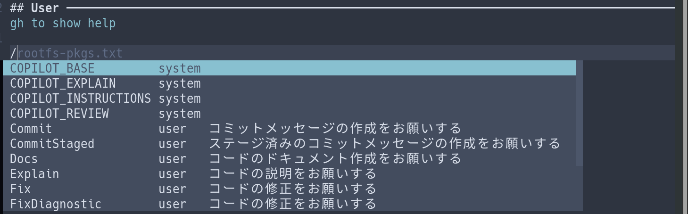
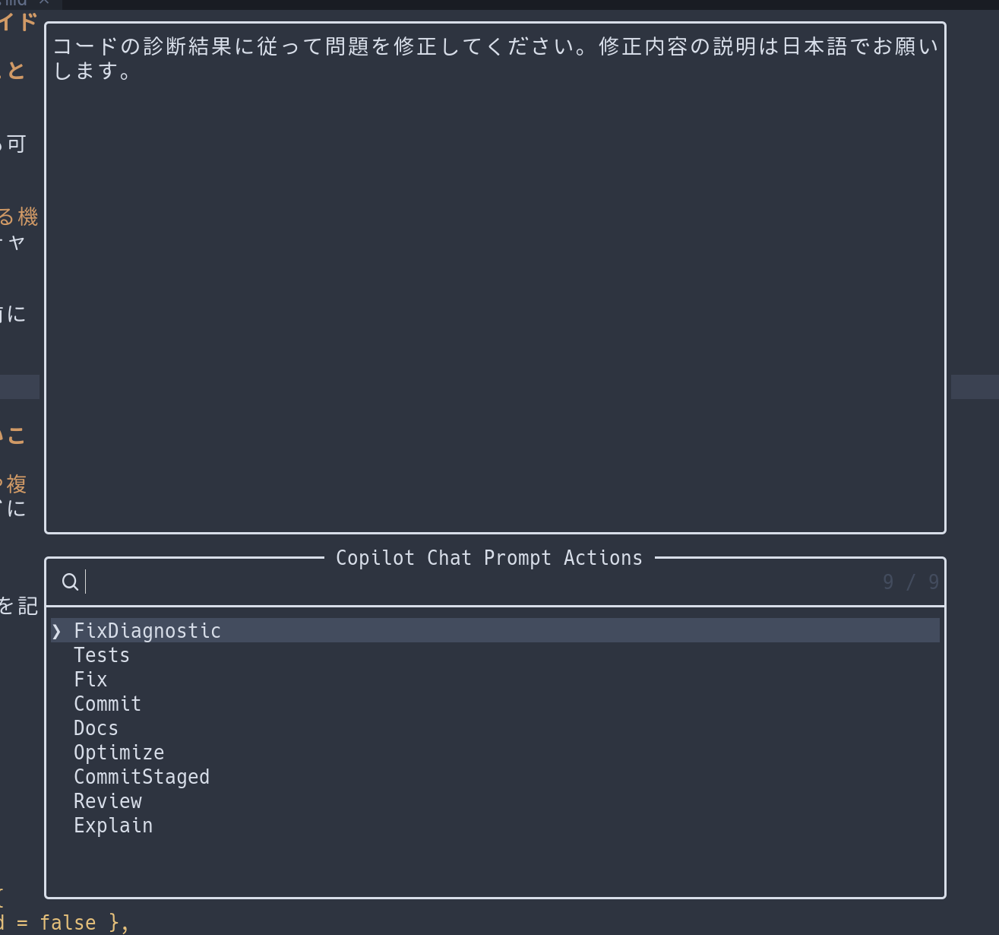

# NeovimでCopilotを使いたい人向けのガイド(2025/7/5時点)

前回の記事で、NeovimのAIコーディング用プラグインを比較しました。今回はそのうちのCopilot.luaについてもう少し詳しく紹介しようと思います。

## NeovimのCopilotプラグインでできること

### 補完機能
利用している補完用プラグインとの連携も可能です。


### チャットモード (Askモードに相当する機能)
指定した行/ファイル/バッファに対してチャットでのやり取りが可能です。変更に対する差分の確認や反映もできます。


また、便利な機能としてプロンプトを事前に用意しておくことができ、スラッシュコマンドで呼び出して利用することができます


また、telescopeと連携することでエディターからプロンプトを直接呼び出すことも可能です。これは他のプラグインにはなかなかない機能で便利だと感じました。



## NeovimのCopilotプラグインでできないこと

### AIエージェントによるファイル作成や複数ファイルの編集
VSCodeのCopilotChatにおけるAgentモードに相当する機能は現状利用ができません

## 設定方法

ここでは `lazy.nvim` を使った設定方法を記載しています。

### Copilot
* [zbirenbaum/copilot.lua](https://github.com/zbirenbaum/copilot.lua)
* `:Copilot auth` で認証を行います。

```lua
	{
		"zbirenbaum/copilot.lua",
		cmd = "Copilot",
		event = "InsertEnter",
		config = function()
			require("copilot").setup({
				suggestion = { enabled = false },
				panel = { enabled = false },
				auto_trigger = false,
			})
		end,
	},
```

### Copilot-cmp
* [zbirenbaum/copilot-cmp](https://github.com/zbirenbaum/copilot-cmp?tab=readme-ov-file#configuration)

利用している補完用プラグインによって、必要な追加設定が異なります。
詳細は [こちら](https://github.com/zbirenbaum/copilot-cmp?tab=readme-ov-file#configuration) を参考にしてください。

```lua
	{
		"zbirenbaum/copilot-cmp",
		config = function()
			require("copilot_cmp").setup({})
		end,
	},
```

### CopilotChat
* [CopilotC-Nvim/CopilotChat.nvim](https://github.com/CopilotC-Nvim/CopilotChat.nvim)

```lua
	{
		"CopilotC-Nvim/CopilotChat.nvim",
		branch = "main",
		cmd = { "CopilotChat", "CopilotChatOpen" },
		build = "make tiktoken", -- Only on MacOS or Linux
		config = function()
			require("configs.copilot-chat")
		end,
	},
```

## CopilotChatで使えるプロンプトの接頭辞

CopilotChatでは、プロンプトでの接頭辞を活用できます。

### 1. `/` — **プリセット／スラッシュコマンド**

`/` に続けてコマンド名やプリセット名を書くと、あらかじめ用意された定型プロンプトを呼び出せます。

* 例: `/Explain` → 選択中のコードの解説を依頼
* 例: `/Tests` → 単体テストを生成
* 例: `/Fix` → バグ修正提案

利用できるプリセットは環境や設定に応じて異なり、`/` を入力すると候補がポップアップします。


### 2. `#` — **コンテキスト変数（Context）**

`#` に続けてコンテキスト名と必要に応じて入力を指定することで、チャットに「追加情報」を渡せます。以下のようなものがあります：

* `#buffer` … 現在のバッファ内容
* `#buffer:2` … バッファ番号 2 の内容
* `#files:*.js` … ワークスペース内の `*.js` ファイル全体
* `#git:staged` … ステージされた git diff
* `#url:https://…` … 指定 URL の内容取得

AI は必要に応じて「このコンテキストが欲しい」と提案してくることもあります。

### 3. `>` — **スティッキープロンプト（Sticky Prompt）**

Markdown の引用記法と同じく行頭に `>` を置くと、そのプロンプトは「スティッキー（常に貼り付け）」として保持され、**新しいチャットを始めるたびに自動で先頭に挿入**されます。

* 例:

  ```
  > You are a helpful coding assistant.
  > Please respond concisely.
  ```

  とすると、どんな質問をしても毎回この指示が一番最初に送られます。
  設定ファイルでデフォルトのスティッキープロンプトを登録することも可能です。

これらを組み合わせることで、

* `/Review #buffer` のように「現在のバッファをレビューしてほしい」
* 事前に `> markdown` を貼って「以降の回答を Markdown 形式で」
  …といった柔軟なチャット操作が可能になります。

## まとめ

AIの補完機能については、競合が少なくCopilot.luaが無難な選択肢になりそうです。
また、CopilotChatは機能としてはシンプルで、まだAIを使ったコーディングを行ったことがない方にとっては取り入れやすいプラグインかと思います。
但し、Askモード相当の機能しかないため、がっつりコードを書く人にとっては機能的に物足りないプラグインという感想です。
まだ開発も続いていそうなのでまた大きなアップデートが来たら記事にしてみたいと思います。
